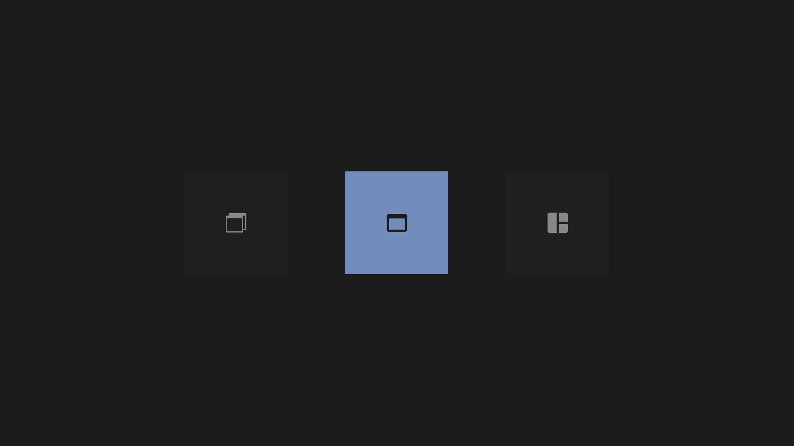
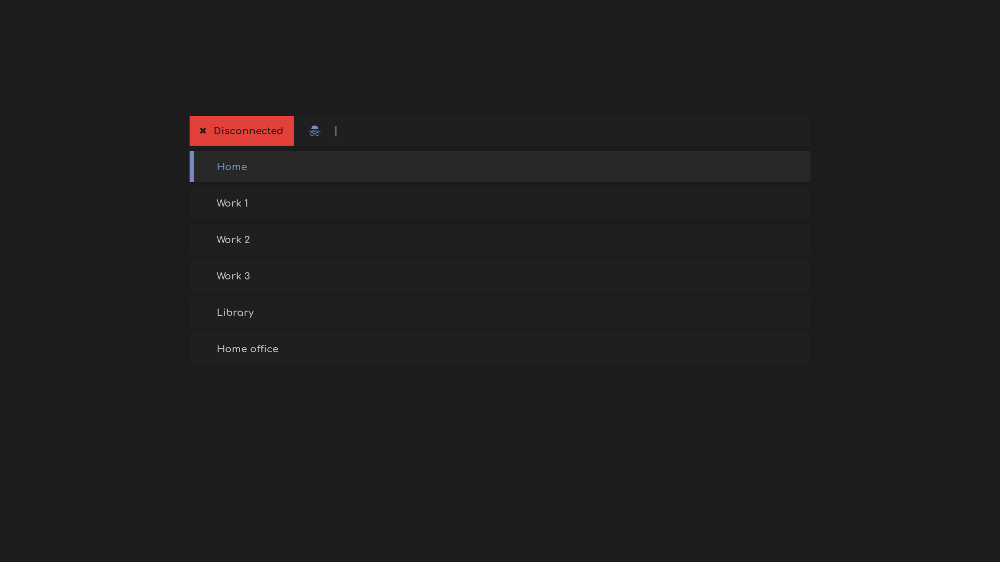
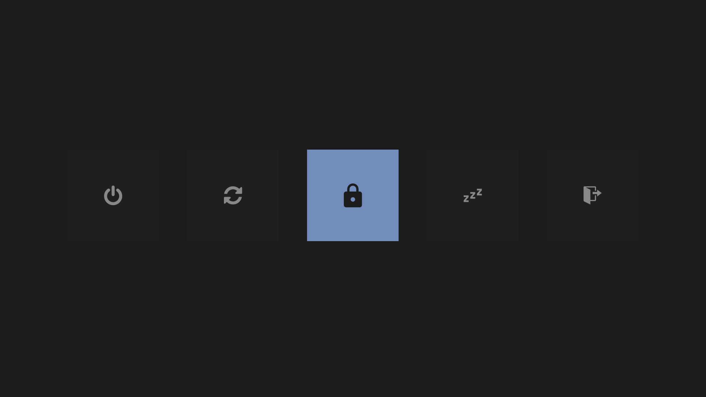

# Rofi menus

A variety of convenient menus made mainly using [rofi](https://github.com/davatorium/rofi) and its dmenu emulation.

A video showcasing the menus in action is available [here](https://old.reddit.com/r/unixporn/comments/cvqc6s/oc_handy_menus_made_with_rofi/).

[Here is a showcase](https://gitlab.com/vahnrr/rofi-menus/blob/master/colorschemes.md) of the current colorschemes.

## List of menus

### Apps menu

> appsmenu

Call rofi in its drun mode to start desktop programmes.


### i3 layout menu

> i3layoutmenu

Change the current layout of [i3wm](https://github.com/i3/i3).



### MPD menu

> mpdmenu

Control the song you play through [mpd (the Music Player Daemon)](https://github.com/MusicPlayerDaemon/).


**Functionnalities:**
- The first 4 options do what you expect them to do
- *(For repeat and random only)* Green means on and red means off, choosing these will toggle them

### Network menu

> networkmenu

Network manager menu (a themed version of [this original script](https://github.com/firecat53/networkmanager-dmenu)).


### Network Manager VPN menu

> nmvpnmenu

Manage your active vpn connection in a few keystrokes.




**Functionnalities:**
- *(Connected)* Choosing the active (green one) option will disconnect from the active vpn
- *(Connected)* Choosing another option than the active vpn will disconnect from the active vpn and connected to the chosen one
- *(Disconnected)* Choosing an option will simply connect to this vpn

### Power menu

> powermenu

A classic power menu.



### Screenshot menu

> scrotmenu

Take screenshots using [scrot](https://github.com/dreamer/scrot).


## Use custom colors

These screenshots use the 'Dark steel-blue' from this [set of dotfiles](https://gitlab.com/vahnrr/dots/blob/master/i3-dark-steel-blue), on this repo the colors are located in `themes(<resolution>)/shared/colorschemes/dark-steel-blue.rasi`. You can change the menus theme in `~/.config/rofi/themes/shared/settings.rasi`, by editing the line `@import "<colorscheme>.rasi"`.

A few other themes are located there too ([here is a showcase](https://gitlab.com/vahnrr/rofi-menus/blob/master/colorschemes.md)), do not hesitate to make a pull request if you have made a nice looking colorscheme and wan to share it!

---

Want to use a different colorscheme for some specific menu? Add the `@import "<colorscheme>.rasi"` line in the chosen menu theme file right after the line importing the settings.

## Installation

### Arch Linux

The package is available in the Arch User Repository as [rofi-menus-git](https://aur.archlinux.org/packages/rofi-menus-git)

```
yay -S rofi-menus-git
```

### Manual installation

#### Menus dependencies and fixes

First of all make sure you have `rofi` installed:
```bash
# Arch / Arch-based
pacman -S rofi
# Debian / Ubuntu
apt-get install rofi
# Fedora
dnf install rofi
```

These menus have been made on my machines (1366x768 and 1920x1080 resolutions) with rofi version **1.5.4-1**, they *might* not work on earlier version although it should be fine.

##### Fonts

The menus uses 3 fonts:

- **Comfortaa** ([preview](https://www.dafont.com/comfortaa.font) and [source](https://www.deviantart.com/aajohan/art/Comfortaa-font-105395949)) used in appsmenu, mpdmenu, nmvpnmenu for the normal text
- **Hurmit Nerd Font Mono** ([preview](https://app.programmingfonts.org/#hermit) and [source](https://github.com/ryanoasis/nerd-fonts/tree/master/patched-fonts/Hermit)) used in all the menus for the icons
- **RobotoMono Nerd Font** ([preview](https://app.programmingfonts.org/#roboto) and [source](https://github.com/ryanoasis/nerd-fonts/tree/master/patched-fonts/RobotoMono)) used in networkmenu for the monospace text

If you wish to change them dig in the resolution file you are using: `~/.config/rofi/themes/shared/resolutions/<your_resolution>.rasi`.

**Warning:** changing the `@icon-font` variable to another font has a high chance of messing most menus' layout.

##### Apps menu

The icon theme used is [Paper](https://github.com/snwh/paper-icon-theme), you either need to install it or to change the icon theme to use in `~/.config/rofi/config.rasi`.

##### i3 layout menu

This menu is supposed to work with i3 so if you do not use i3 as your window manager you should not be using it.

##### MPD menu

To interact with MPD, this menu uses the `mpc` package, make sure you have it installed.

##### Network menu

Written in Python, make sure you have it installed, if some functionnalities do not work you might want to get a newer version of this script [here](https://github.com/firecat53/networkmanager-dmenu) or check the issues there to see if someone encountered a similar problem.

Also, make sure you have copied the `networkmanager-dmenu` directory and its content (the `config.ini` file) and placed it in `~/.config/`. You might want to change the terminal defined in `~/.config/networkmanager-dmenu/config.ini` since I use `xfce4-terminal` but you might prefer another one.

##### Network Manager VPN menu

Since the `mapfile` bash command is used, you will need bash with the version **4** or above to run the script of this menu.

To interact with Network Manager, this script uses `nmcli`, but also `grep` and `sed` to parse data, so make sure those are installed.

##### Power menu

It uses `systemctl` to handle most power actions, but also `light-locker` to lock and `i3-msg exit` to log out since I use an i3 session, you might want to tweak this to fit your config.

Also when going to sleep this script pauses MPD using an `mpc` command and mutes the volume using `amixer`, so have these on your system or delete these lines in `powermenu.sh`.

##### Screenshot menu

Make sure you have `scrot` installed.

**Note:** I personally use [i3-script](https://gitlab.manjaro.org/packages/community/i3/i3-scrot) which a verbose wrapper for scrot, sending notifications informing the user of what is happening. The code in `scrotmenu.sh` changes a bit to this:
```bash
# [...]
case $chosen in
    $screen)
        sleep 1; i3-scrot -d
        ;;
    $area)
        i3-scrot -s
        ;;
    $window)
        sleep 1; i3-scrot -w
        ;;
esac
```

#### How to install and use

1. Copy the `config.rasi` file to `~/.config/rofi/` (mainly used by the **appsmenu**, but removing it seems to screw with other menus' theme)
2. Copy the `scripts` directory to `~/.config/rofi/` (you can delete the menus you won't use)
3. Make sure those scripts are executables with the command: `chmod +x ~/.config/rofi/scripts/*`
4. Copy the `themes` directory to `~/.config/rofi/` (you can delete the menus you won't use)
5. Set the resolution to use in `~/.config/rofi/themes/shared/settings.rasi`. If the resolution you want to use is not in the `~/.config/rofi/themes/shared/resolutions` directory, you can copy one of the existing ones and adjust a few variables to make it fit your resolution. The main variables to play around with are `*-window-padding`, `*-listview-spacing` and `*-element-padding`. Do not hesitate to open a pull request to share your custom resolution variables file on this repo for others to use.

##### Optional

> To make it easier to call those menus, you can use the `/usr/local/bin` directory.

1. Create the directory (if it doesn't exist): `sudo mkdir -p /usr/local/bin`
2. Copy the content of the `bins` directory to `/usr/local/bin/`
3. Make yourself (or the user group) the owner of these files so that you can call them without needing root: `sudo chown <username> /usr/local/bin/*menu`
4. Make sure those scripts are executables with the command: `sudo chmod +x /usr/local/bin/*`
5. Test in a new terminal or with an i3 keybinding to call these menus with a simple `<menuname>` command

**Note:** I keep those files in `/usr/local/bin/`, but they are not the actual scripts that you will be running, they will simply call the scripts located in `~/.config/rofi/scripts/`, it is a personnal preference. You could copy the content of `scripts` in `/usr/local/bin/` and it would work like a charm too (although you might want to remove the `.sh` at the end of these in this case). This would be useful if multiple users are supposed to be able to call these menus.

---

> **Required** to use the networkmenu.

1. Copy the `networkmanager-dmenu` directory in `~/.config/`

### Use in i3

Here is a sample of my i3 config where I defined keybindings to use these menus:
```
set $mod Mod4
set $Alt Mod1
bindsym $mod+d                  exec --no-startup-id appsmenu
bindsym $mod+l                  exec --no-startup-id i3layoutmenu
bindsym $mod+m                  exec --no-startup-id mpdmenu
bindsym $mod+n                  exec --no-startup-id networkmenu
bindsym $Alt+v                  exec --no-startup-id nmvpnmenu
bindsym $mod+0                  exec --no-startup-id powermenu
bindsym $mod+s                  exec --no-startup-id scrotmenu
```

**Note:** You would need to do [this](https://gitlab.com/vahnrr/rofi-menus#optionnal) to be able to call the menus this way, otherwise just execute the menus' script.

## TODO

- Find a cleaner way to wait for the first `nmcli` command to be successful in `nmvpnmenu.sh` (line **46**) as without the `sleep 1` it will throw an error, but waiting 1 second is not a safe work around
